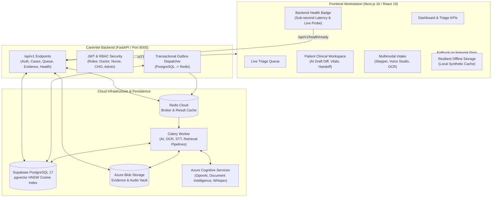

# NIRO-Triage — Intelligent Clinical Triage & Operations Workstation

[](https://nextjs.org/)
[](https://react.dev/)
[](https://tailwindcss.com/)
[](https://www.python.org/)
[](https://fastapi.tiangolo.com/)
[](https://supabase.com/)

> **Next-generation, Human-in-the-Loop Clinical Triage Workstation** built with Next.js 16 and a Python 3.12 FastAPI backend (`CareIntel`). Features multimodal patient intake, AI-assisted draft notes with diff review, resilient offline-first storage fallback, and role-gated clinical execution.

---

> [!IMPORTANT]
> **Non-Diagnostic Clinical Safety Principle:**  
> NIRO-Triage and CareIntel are strictly **non-diagnostic advisory tools**. All AI proposals, transcriptions, and draft notes are treated as provisional suggestions. Final approval, clinical classification, emergency escalation, and handoff decisions remain exclusively under the authority of licensed human clinicians.

---

## 📑 Table of Contents

- [System Architecture](#-system-architecture)
- [Key Features](#-key-features)
- [Dual-Mode Architecture (Live + Resilient Offline)](#-dual-mode-architecture)
- [Quick Start Guide](#-quick-start-guide)
  - [1. CareIntel Backend Setup](#1-careintel-backend-setup-python-312)
  - [2. Next.js Frontend Setup](#2-nextjs-frontend-setup-node-20)
- [Pre-Seeded Demo Clinician Accounts](#-pre-seeded-demo-clinician-accounts)
- [Multimodal Clinical Workflows](#-multimodal-clinical-workflows)
- [API & Health Probes Reference](#-api--health-probes-reference)
- [Repository Structure](#-repository-structure)
- [Troubleshooting & FAQ](#-troubleshooting--faq)

---

## 🏛 System Architecture

NIRO-Triage bridges an emergency clinical frontend with an asynchronous, event-driven Python backend:



---

## ✨ Key Features

### 1. Operational Triage Overview (`/dashboard`)
- Real-time clinical KPIs: **Total Patients**, **Awaiting Review**, **Urgent Review Cases**, and **Average Review Time**.
- Urgency acuity distribution chart and rapid action shortcuts.
- Live priority filtering: *All Cases*, *Urgent Review*, *Prompt Review*, and *Routine Review*.

### 2. Live Clinical Queue (`/queue`)
- Real-time triage status sorting (urgency weight, wait duration, arrival timestamp).
- Role-gated claim & reassignment controls.
- Patient quick-inspect drawer for instantaneous clinical triage without losing queue position.

### 3. Patient Clinical Workspace (`/patients/[id]`)
- **Summary Tab**: Active vital trends, chief complaints, acuity badges, and clinical timeline.
- **AI Draft Reviewer**: Side-by-side split diff modal showing baseline notes vs. AI-suggested recommendations, allowing one-click **Accept**, **Modify**, or **Reject**.
- **Referral Handoff Modal**: Structured inter-facility clinical summary generation with urgency routing.
- **Patient Edit Modal**: Instant inline updating of patient demographics, vitals, and condition indicators.

### 4. Multimodal Intake (`/intake`)
- **4-Step Intake Stepper**: Demographics & consent validation $\rightarrow$ Clinical vitals & symptoms $\rightarrow$ Evidence uploads $\rightarrow$ Final review & queue placement.
- **Voice Studio (`/intake/voice`)**: Real-time microphone audio capture with animated audio waveform, live diarized transcription preview, and auto-populated case fields.
- **Document & Lab Viewer (`/intake/report` & `/reports`)**: High-resolution document inspector with OCR bounding boxes and structured entity extraction.

### 5. Role-Based Access Control (RBAC)
- Fine-grained permission matrix across clinical personas:
  - `doctor`: Complete review, medication modification, AI draft approval, referral dispatch.
  - `nurse`: Triage review, vital logging, evidence upload, priority elevation.
  - `health_worker` (CHO): Field intake, consent capture, preliminary vitals logging.
  - `admin`: User provisioning, facility scoping, audit log review.

---

## ⚡ Dual-Mode Architecture

NIRO-Triage is built for resilience in unpredictable healthcare environments:

| Mode | Trigger | Storage & Backend | Clinician Experience |
| :--- | :--- | :--- | :--- |
| **Live Pipeline** | Backend healthy (`/api/v1/health/ready` returns 200) | Supabase PostgreSQL + Redis + Celery + Azure AI | Live AI drafting, pgvector semantic search, cloud evidence sync, real-time queue. |
| **Resilient Offline** | Network disconnect or backend offline | Local In-Memory & LocalStorage Synthetic Cache | Zero downtime, instant UI response, full clinical editing, automatic live re-sync upon reconnection. |

The status is always visibly communicated in the top navigation bar via the **Backend Health Badge**:
- 🟢 **API: Supabase DB** (Live — shows round-trip latency, e.g. `1868ms`)
- 🟡 **Offline Mode / API: Local Cache** (Resilient offline storage active)

---

## 🚀 Quick Start Guide

### Prerequisites
- **Node.js**: `v20.x` or `v22.x` (with `npm`)
- **Python**: `3.12.x`
- **uv**: Python package and project manager (`pip install uv` or `py -m pip install uv`)
- **Git**

---

### 1. CareIntel Backend Setup (Python 3.12)

Open a terminal in the `CareIntel` directory:

```bash
cd CareIntel

# 1. Sync dependencies into virtual environment
uv sync

# 2. Configure environment
# Copy template if .env does not exist:
# cp .env.example .env

# 3. Apply database migrations to Supabase
# On Windows:
.\.venv\Scripts\python.exe -m alembic upgrade head
# On Linux/macOS:
.venv/bin/alembic upgrade head

# 4. Seed demo clinician accounts
# On Windows:
.\.venv\Scripts\python.exe scripts/seed_demo_accounts.py
# On Linux/macOS:
.venv/bin/python scripts/seed_demo_accounts.py

# 5. Run infrastructure verification (verifies Supabase, Redis, Celery, Azure Blob)
# On Windows:
.\.venv\Scripts\python.exe scripts/verify_infra.py
# On Linux/macOS:
.venv/bin/python scripts/verify_infra.py

# 6. Start the FastAPI server (Port 8000)
# On Windows:
.\.venv\Scripts\python.exe -m uvicorn careintel.main:app --host 127.0.0.1 --port 8000
# On Linux/macOS:
.venv/bin/uvicorn careintel.main:app --host 127.0.0.1 --port 8000
```

#### Optional: Start Async Celery Worker & Outbox Dispatcher
For full background AI processing and event dispatching:

```bash
# Terminal A — Celery Worker
# Note: On Windows, Celery requires '-P solo'
.\.venv\Scripts\python.exe -m celery -A careintel.workers.celery_app:celery_app worker -P solo --loglevel=INFO -Q careintel_default,careintel_processing,careintel_retrieval,careintel_ai,careintel_workflow

# Terminal B — Transactional Outbox Dispatcher
.\.venv\Scripts\python.exe -m careintel.workers.outbox_runner --interval 2
```

---

### 2. Next.js Frontend Setup (Node 20+)

Open a terminal in the repository root (`NIRO-Triage`):

```bash
# 1. Install frontend dependencies
npm install

# 2. Build for production
npm run build

# 3. Start the production server
npm start
# Alternatively, start development server with Turbopack:
# npm run dev
```

The clinical workstation is now accessible at **`http://localhost:3000`**.

---

## 👥 Pre-Seeded Demo Clinician Accounts

The database includes pre-configured clinician accounts for rapid demonstration and testing:

| Email | Role | Default Password | Recommended Workflow |
| :--- | :--- | :--- | :--- |
| `doctor@careintel.local` | **Doctor / Medical Officer** | `demo123` | AI Draft Review, Medication edits, Referral Sign-off |
| `nurse@careintel.local` | **Triage Nurse** | `demo123` | Queue prioritization, Vital logging, Rapid triage |
| `cho@careintel.local` | **Community Health Officer** | `demo123` | Patient intake, Voice dictation, Consent capture |
| `admin@careintel.local` | **System Administrator** | `demo123` | Facility management, Security audits, User provisioning |

> Login at: [`http://localhost:3000/auth/login`](http://localhost:3000/auth/login)

---

## 📡 API & Health Probes Reference

CareIntel provides OpenAPI and interactive documentation at:
- **Swagger UI**: [`http://127.0.0.1:8000/api/docs`](http://127.0.0.1:8000/api/docs)
- **OpenAPI Schema**: [`http://127.0.0.1:8000/api/openapi.json`](http://127.0.0.1:8000/api/openapi.json)

### Key Endpoints

| Method | Endpoint | Description |
| :--- | :--- | :--- |
| `GET` | `/api/v1/health/live` | Process liveness probe (`{"status":"ok"}`) |
| `GET` | `/api/v1/health/ready` | Full dependency readiness (Database, Redis, Blob Storage) |
| `POST` | `/api/v1/auth/login` | Clinician login; issues signed JWT access token |
| `GET` | `/api/v1/auth/me` | Fetch active clinician profile, roles, and facility scope |
| `GET` | `/api/v1/queue` | Retrieve triage queue items with priority sorting |
| `GET` | `/api/v1/cases/{case_id}` | Fetch full clinical case record and timeline |
| `POST` | `/api/v1/cases` | Create new clinical case with consent verification |
| `POST` | `/api/v1/drafts/{id}/accept` | Accept AI advisory draft note |
| `POST` | `/api/v1/drafts/{id}/edit` | Clinician-modified AI draft acceptance |
| `POST` | `/api/v1/audio/speech` | Text-to-speech synthesized audio generation |

---

## 📂 Repository Structure

```text
NIRO-Triage/
├── src/                               # Next.js 16 App Directory
│   ├── app/                           # App Router Pages & Layouts
│   │   ├── dashboard/                 # Operational overview & KPIs
│   │   ├── queue/                     # Live clinical triage queue
│   │   ├── patients/                  # Patient directory & workspace
│   │   │   └── [id]/                  # Clinical workspace (AI Diff, Summary)
│   │   ├── intake/                    # Multimodal intake stepper
│   │   │   ├── voice/                 # Voice dictation studio
│   │   │   └── report/                # OCR & document report viewer
│   │   ├── analytics/                 # Triage performance & SLA analytics
│   │   └── auth/                      # Authentication & login
│   ├── components/                    # Reusable React UI Components
│   │   ├── common/                    # BackendHealthBadge, Navbars, Headers
│   │   ├── workspace/                 # AiDraftModal, ReferralModal, EditModal
│   │   └── intake/                    # Vitals form, Audio recorder
│   ├── context/                       # RoleContext & Auth state
│   └── lib/api/                       # Typed CareIntel API client & fallback cache
│
├── CareIntel/                         # Python 3.12 FastAPI Backend
│   ├── src/careintel/                 # Core Python package
│   │   ├── api/v1/                    # REST route controllers
│   │   ├── application/               # Case, review, and auth use cases
│   │   ├── domain/                    # State machines & business policies
│   │   ├── infrastructure/            # Azure Blob, Redis, and AI adapters
│   │   ├── persistence/               # SQLAlchemy models & repositories
│   │   └── workers/                   # Celery tasks & outbox runner
│   ├── migrations/                    # Alembic ordered schema revisions (0001-0015)
│   ├── scripts/                       # Operational verification & seed scripts
│   ├── pyproject.toml                 # Backend dependencies & tools
│   └── STARTUP.md                     # Comprehensive backend operations manual
│
├── AGENTS.md                          # Framework rules & documentation links
└── README.md                          # Master documentation (this file)
```

---

## 🛠 Troubleshooting & FAQ

### 1. `BackendHealthBadge` displays "Offline Mode / API: Local Cache"
- Verify that the FastAPI backend is running on `http://127.0.0.1:8000`.
- In PowerShell, run: `Invoke-RestMethod -Uri "http://localhost:8000/api/v1/health/ready"`.
- If using Supabase on an IPv4 network, verify that `DATABASE_URL` in `CareIntel/.env` uses the AWS regional pooler host (`aws-0-<region>.pooler.supabase.com:5432`) rather than the direct `db.<project>.supabase.co` host (which is IPv6-only).

### 2. Celery Worker fails to start on Windows
- Windows does not support `fork()`. Always run Celery with the solo pool flag:  
  `celery -A careintel.workers.celery_app:celery_app worker -P solo ...`

### 3. Database connection pool timeout
- The Supabase pooler operates in session mode on port 5432 and transaction mode on port 6543. For Alembic DDL migrations and prepared statements, use port **5432**.

---

## ⚖ License & Compliance

Built for clinical workflow research and engineering demonstration. Distributed under standard project licensing. Refer to [`CareIntel/STARTUP.md`](file:///c:/Users/Monarch/NIRO-Triage/CareIntel/STARTUP.md) for full compliance, audit immutability, and data retention specifications.
