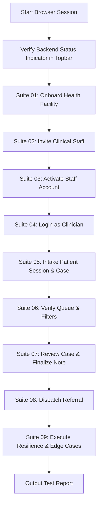

# NIRO Triage - Browser Agent E2E Testing Suite

> **Notice for Browser Agents**:
> This test suite is designed for automated browser agents and E2E test runners executing against a **live/hosted backend**.
> **NO MOCK DATA OR REQUEST INTERCEPTION** is used. All network requests must communicate with the live backend service (`NEXT_PUBLIC_API_BASE_URL` or configured hosted endpoint).

---

## 1. Quick Reference & Test Suites

The test suite is organized into 9 modular, sequential procedure documents covering every feature, user role, and edge case:

| Suite | File | Focus Area | Cases |
| :--- | :--- | :--- | :--- |
| **Suite 01** | [`01_FACILITY_ONBOARDING.md`](./procedures/01_FACILITY_ONBOARDING.md) | Facility & Administrator Registration (`/auth/register-facility`) | TC-ONB-001 – TC-ONB-008 |
| **Suite 02** | [`02_STAFF_INVITATION_AND_RBAC.md`](./procedures/02_STAFF_INVITATION_AND_RBAC.md) | Clinician Invitations & RBAC (`/settings`) | TC-INV-001 – TC-INV-007 |
| **Suite 03** | [`03_STAFF_ACTIVATION.md`](./procedures/03_STAFF_ACTIVATION.md) | Token, OTP & Password Activation (`/auth/activate`) | TC-ACT-001 – TC-ACT-007 |
| **Suite 04** | [`04_AUTHENTICATION_AND_LOGIN.md`](./procedures/04_AUTHENTICATION_AND_LOGIN.md) | Sign In, Role Switching & Session Security (`/auth/login`) | TC-LOG-001 – TC-LOG-008 |
| **Suite 05** | [`05_NEW_PATIENT_INTAKE.md`](./procedures/05_NEW_PATIENT_INTAKE.md) | Multilingual Audio, OCR, Vitals & Consent (`/intake`) | TC-INT-001 – TC-INT-010 |
| **Suite 06** | [`06_CLINICAL_QUEUE_AND_FILTERS.md`](./procedures/06_CLINICAL_QUEUE_AND_FILTERS.md) | Queue Management, Priority Filters & Search (`/queue`, `/dashboard`) | TC-QUE-001 – TC-QUE-008 |
| **Suite 07** | [`07_PATIENT_REVIEW_AND_FINALIZATION.md`](./procedures/07_PATIENT_REVIEW_AND_FINALIZATION.md) | Clinical Review, Fact Editing & Signoff (`/patients/[id]`) | TC-REV-001 – TC-REV-009 |
| **Suite 08** | [`08_REFERRAL_DISPOSITION.md`](./procedures/08_REFERRAL_DISPOSITION.md) | Institutional Referrals & Escalations (`/patients/[id]`) | TC-REF-001 – TC-REF-006 |
| **Suite 09** | [`09_RESILIENCE_AND_EDGE_CASES.md`](./procedures/09_RESILIENCE_AND_EDGE_CASES.md) | Offline Toggle, Boundary Values & Network Drops | TC-EDG-001 – TC-EDG-010 |

---

## 2. Machine-Readable Test Matrix

All test cases, preconditions, exact selectors, inputs, and expected outcomes are indexed in:
**[`TEST_MATRIX.json`](./TEST_MATRIX.json)**

Browser agents can parse this JSON file programmatically to track pass/fail state, execute parameterized test loops, and log verification artifacts.

---

## 3. Browser Agent Operating Directives

### Directives:
1. **Target Base URL**: Default is `http://localhost:3000` (or `process.env.BASE_URL`).
2. **Backend Target**: Ensure Spring Boot backend is reachable on port 9090 or the hosted domain specified in `NEXT_PUBLIC_API_BASE_URL`.
3. **No Mocks**: Do NOT use `page.route()` to mock API endpoints. Let network calls reach the real backend.
4. **Resilient Waiting**:
   - Prefer waiting for selector visibility over arbitrary sleep timeouts.
   - Wait for animations or transitions (e.g. `opacity-100`, `.animate-spin` completion).
5. **State Tracking**:
   - When a test generates dynamic IDs (such as `facilityCode`, `facilityPublicId`, or `inviteToken`), capture and carry them forward into subsequent test steps.

---

## 4. Execution Standard Procedure



---

## 5. Result Reporting Format

When the browser agent completes a test case, it must record results in the following format:

```json
{
  "testCaseId": "TC-ONB-001",
  "name": "Successful Facility & Admin Onboarding",
  "status": "PASSED",
  "durationMs": 1420,
  "artifacts": {
    "generatedFacilityCode": "FAC-CHC-XYZ123",
    "adminUserId": "usr-8a9b2c",
    "screenshotPath": "screenshots/TC-ONB-001.png"
  },
  "networkEvents": [
    {
      "url": "http://localhost:9090/api/v1/triagemitra/onboarding/facility-admin",
      "method": "POST",
      "statusCode": 201
    }
  ]
}
```
